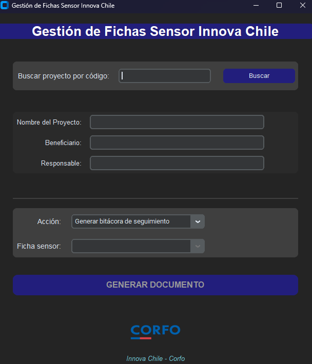
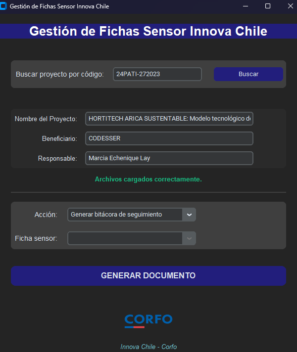
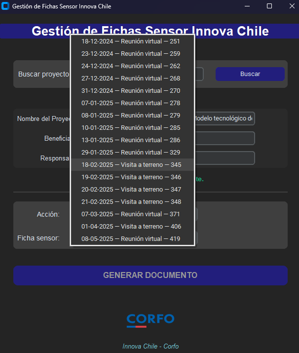

# Gestión de Fichas Sensor Innova Chile
Aplicación de escritorio para la gestión, búsqueda y generación de documentos asociados a reuniones y visitas técnicas de proyectos Innova Chile (CORFO).

### 🖼️ Vista de la aplicación

A continuación se muestran pantallas del sistema en funcionamiento:

#### 🔍 Pantalla principal



#### 📑 Carga de un proyecto



#### 📑 Selección de ficha



### 🚀 Arquitectura
Lenguaje: Python 3.11+

Framework UI: customtkinter

Procesamiento Word: python-docx

Imágenes: Pillow (PIL)

### Estructura de carpetas:

```text
ficha_sensor_project/
├── src/
│   ├── api/              # Cliente SOAP y servicios externos
│   ├── assets/           # Logos, íconos, imágenes institucionales
│   ├── excel/            # Lectura de archivos Excel
│   ├── generator/        # Generadores de documentos Word
│   ├── models/           # Modelos de datos (ProjectInfo, etc.)
│   ├── templates/        # Plantillas Word (docx)
│   ├── ui/               # Interfaz gráfica (MainApp.py)
│   └── utils/            # Utilidades varias (fechas, archivos)
├── main.py               # Punto de entrada
└── README.md
```

### 🖥️ Vista principal
La interfaz es moderna y minimalista, basada en los lineamientos visuales de CORFO:

Logo institucional e ícono de ventana personalizado.

Modo oscuro y paleta de colores institucional.

Inputs organizados en bloques con separación clara de acciones y resultados.

Mensajes visuales de progreso y confirmación de carga.


### 🧩 Funcionalidades
#### - Búsqueda de proyecto por código:

Consulta información desde un archivo Excel y la cabecera SOAP.

Despliega nombre del proyecto, beneficiario y responsable de inmediato.

#### - Listado de reuniones y visitas:

Las fechas se muestran ordenadas cronológicamente.

El selector muestra fecha, tipo de reunión y el ID de la ficha asociada.

#### - Acciones disponibles:

Generar bitácora de seguimiento (documento Word con todas las reuniones/visitas del proyecto).

Generar registro de visitas (documento Word para una sola ficha seleccionada).

#### - Control de flujo y validación:

El botón GENERAR DOCUMENTO se activa solo con selección válida.

Mensajes claros: “Cargando...”, “Archivos cargados correctamente”, “No se encontró la ficha seleccionada”, etc.

Soporte para medios de verificación:

Cada registro generado referencia correctamente el documento individual correspondiente.

### 📄 Resultados esperados
Bitácora de seguimiento: Documento Word tipo tabla, con todas las reuniones/visitas ordenadas, incluyendo fecha, tipo, responsable, observaciones, compromisos y medio de verificación.

Registro individual de visita/reunión: Documento Word para una fecha/ID específica, con todos los campos mapeados y formato institucional.

Archivos generados automáticamente en la carpeta Descargas del usuario.

### 🛠️ Cómo ejecutar
Instala dependencias con pip install -r requirements.txt.


### 💡 Notas técnicas
El mapeo de campos está diseñado para robustez ante nombres inconsistentes.

El proyecto es modular y fácil de mantener. Solo necesitas adaptar ExcelReader.py y el cliente SOAP para nuevas fuentes de datos.

La lógica de ordenamiento por fecha y el control de medios de verificación están centralizados en los generadores Word.

El ícono y logos se configuran desde FileUtils.py y se pueden reemplazar fácilmente por otros institucionales.

¿Dudas, sugerencias o mejoras? ¡Bienvenido a contribuir!
Desarrollado con ❤️ para Innova Chile - CORFO

